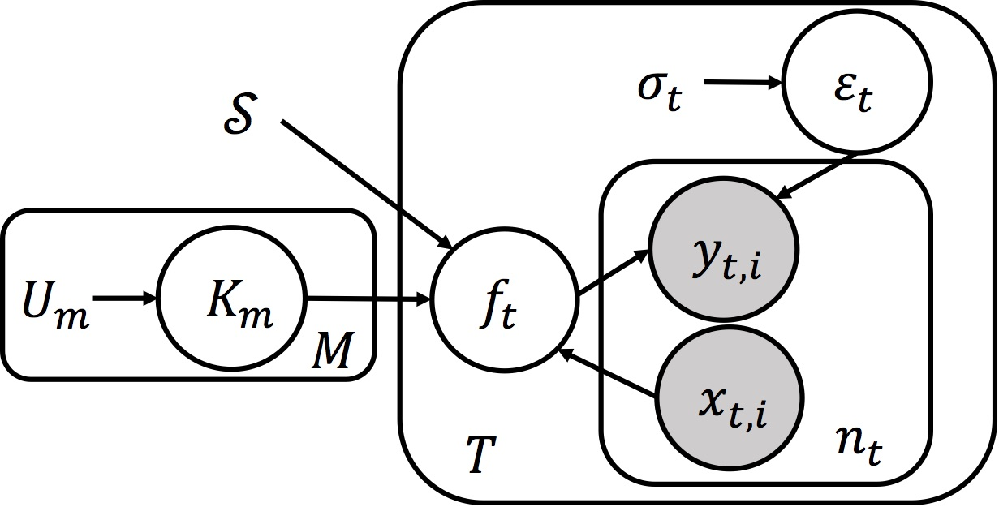

# Multi-linear Gaussian Process (MLGP)
High-order correlations are ubiquitous in modern data
analytics. MLGP is a Gaussian process model that learns high-order structure in the data using multi-linear (tensor). kernel. 

[](https://travis-ci.org/voxpelli/node-github-publish)
[](https://coveralls.io/r/voxpelli/node-github-publish)
[](https://gemnasium.com/voxpelli/node-github-publish)

Multilinear Gaussian process regression, implemented in MATLAB.
See details in our AISTATS 2018 paper [Tensor Regression meets Gaussian Processes](http://proceedings.mlr.press/v84/yu18a/yu18a.pdf)



# Test Example

**example dataset**

The Restaurant & Consumer Dataset contains data to build a restaurant recommender
system where the objective is to predict
consumer ratings given to different restaurants. Each
of the p3 = 138 consumers gave p2 = 3 scores for
food quality, service quality and overall quality. The
dataset also contains p1 = 45 various descriptive attributes
of the restaurants (such as geographical position,
cuisine type and price band). We consider this
to be a regression problem where the objective is to
predict the scores given the attributes of a restaurant
as an input query. Since there are 138 consumers, this
leads to a multitask problem composed of 138x3 regression
tasks

**testing script**

```matlab
run test_mlgp.m
```

## Citation

If you think the repo is useful, we kindly ask you to cite our work at 

```
@article{yu2017tensor,
  title={Tensor Regression Meets Gaussian Processes},
  author={Yu, Rose and Li, Guangyu and Liu, Yan},
  booktitle={Artificial Intelligence and Statistics},
  year={2018}
}
```